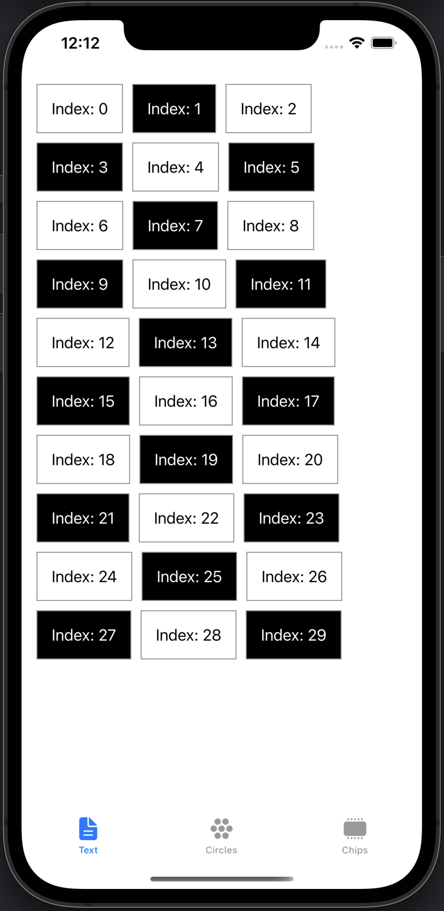
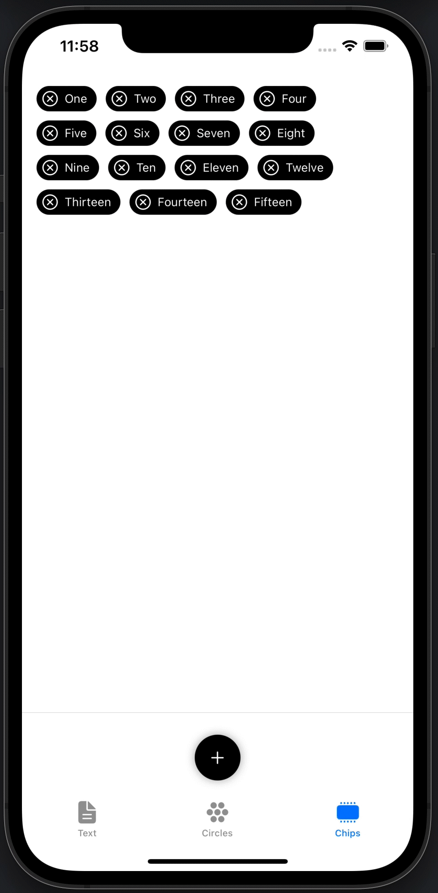
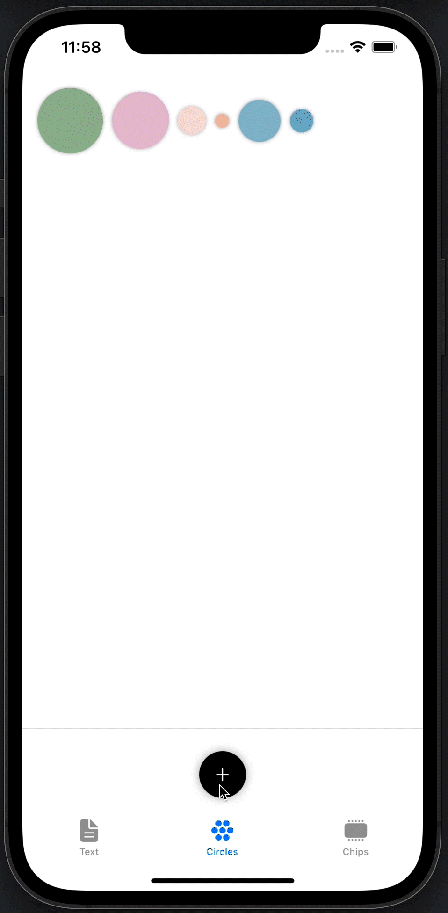

## FlexCollection

A very simple flexible collection view using SwiftUI that automatically expands as content is added to it, with proper layout flow (horizontal wrap around). 

SwiftUI already has built in containers for flexible grids (e.g. LazyVGrid), but they do not currently support dynamically adaptive flow based on the content. For example, LazyVGrid can dynamically select the number of columns to use, but every row in the grid will share the same number of columns.

### Notes

* FlexCollection computes the size of each cell and flows the content based on the available space.
* Each row may use a different number of columns as needed to fit the content properly.
* If a cell's layout appears compacted, verify that the maxUsableWidth (see below) is less than the frame width.
* This is not a lazy structure, and all cells will be generated up front during layout. 
* Layout is recomputed when the number of elements changes. 

There is a lot that this continer doesn't do (!), and there are several obvious areas for optimization. However, the goal for this was to create a simple single file container that provides a basic horizontal flow.

### Example usage

Drop [FlexCollection.swift](Source/FlexCollectionDemo/FlexCollection.swift) into your project, and then invoke the View with the following parameters:

* **elementCount**: the number of elements you wish to store in the collection.
* **maxUsableWidth**: the available width that the collection should flow before wrapping around.
* **createElement**: a trailing closure that generates one element at a time for the collection.

For example, the following code was used to generate 30 Text views and flow them within a maximum width of 390 (first screenshot above):

    
    FlexCollection(elementCount: 30, maxUsableWidth: 390) {
        index in
        Text("Index: \(index)")
    }
    

### More information

For more advanced examples, check out this [example code](Source/FlexCollectionDemo/ContentView.swift).
